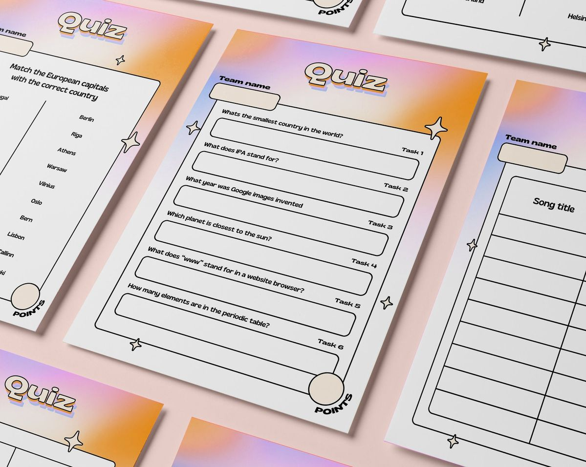

<div align="center">

# QuizMind

### *Master New Skills with Curated Interactive Quizzes*

[](https://developer.mozilla.org/en-US/docs/Web/HTML)
[](https://developer.mozilla.org/en-US/docs/Web/CSS)
[](https://developer.mozilla.org/en-US/docs/Web/JavaScript)
[](https://fontawesome.com/)
[](https://fonts.google.com/)

[](https://github.com/)
[](https://github.com/)
[](LICENSE)
[](https://github.com/)

<br/>

> A sleek, fully frontend quiz platform built with vanilla HTML, CSS, and JavaScript.  
> Designed to feel modern, fast, and intuitive — no frameworks, no dependencies, just clean code.

<br/>



</div>

---

##  Table of Contents

- [ Introduction](#-introduction)
- [ Features](#-features)
- [ Technologies Used](#️-technologies-used)
- [ Authentication System](#-authentication-system)
- [ Responsive Design](#-responsive-design)
- [ Mobile Navigation Drawer](#-mobile-navigation-drawer)
- [ Quiz System](#-quiz-system)
- [ LocalStorage Usage](#-localstorage-usage)
- [ UI/UX Design Highlights](#-uiux-design-highlights)
- [ Folder Structure](#-folder-structure)
- [ Future Improvements](#-future-improvements)
- [ Installation & Usage](#️-installation--usage)
- [ Contributing](#-contributing)

---

##  Introduction

**QuizMind** is a modern, fully interactive quiz platform built entirely with **vanilla HTML, CSS, and JavaScript** — no frameworks, no build tools, no backend. It was designed as a portfolio-grade frontend project that demonstrates real-world UI patterns, dynamic JavaScript rendering, client-side routing, and thoughtful UX design.

The platform allows users to browse quiz categories, take timed quizzes, track their progress, view a global leaderboard, and review their past results — all within a single-page application architecture powered by the History API.

Whether you're a learner wanting to test your knowledge or a developer looking for frontend inspiration, QuizMind delivers a polished and performant experience right in the browser.

---

##  Features

###  Landing Page
- Animated hero section with headline, description, and call-to-action buttons
- **"See How It Works"** button smoothly scrolls to the Three Steps to Mastery section
- Trending categories grid with direct links to quiz intro pages
- Step-by-step mastery guide section
- Full-width CTA banner to drive engagement

###  Categories Page
- Dynamically rendered quiz category cards from the data file
- Each card displays a real cover image, category name, and is fully clickable
- Featured "Weekly Special" section with highlighted content
- Smooth hover animations on all cards

###  Quiz Intro Page
- Per-category cover image, description, question count, and estimated time
- Resume Quiz / Restart Quiz logic based on saved progress
- Stat cards showing enrolled students, average rating, and certificate availability

###  Active Quiz Interface
- One question at a time with labeled answer options (A, B, C, D)
- Live countdown timer per category
- Progress bar that fills as you advance
- Previous Question button — safely navigates back without affecting score
- Answer state is restored when navigating back (your previous selection is highlighted)
- Finish Quiz button on the last question

###  Results Page
- Final score display with large typography
- Accuracy percentage pill
- Time spent (real elapsed time, not just the limit)
- Detailed question-by-question summary with ✔ / ✘ indicators
- Skipped questions shown with a neutral — indicator
- Play Again and Back to Home actions

###  Leaderboard
- Aggregates all user scores stored in localStorage
- Sorted by score descending
- Shows username, category, and score per entry

###  My Quizzes
- Lists all quizzes the user has started or completed
- Shows real cover image per quiz (matching the categories page)
- Displays progress bar, completion status, and final score
- Clicking a completed quiz takes you back to its results
- Clicking an in-progress quiz resumes from where you left off

###  Dark / Light Mode
- System preference detection on first visit
- Manual toggle with a sun/moon icon button
- Preference persisted in localStorage across sessions
- Smooth CSS variable transition across the entire UI

---

##  Technologies Used

| Technology | Purpose |
|---|---|
| **HTML5** | Semantic page structure and SPA view management |
| **CSS3** | Custom design system with CSS variables, Grid, Flexbox, animations |
| **JavaScript (ES6+)** | Dynamic rendering, quiz logic, routing, state management |
| **Font Awesome 7** | Icon library used throughout the UI |
| **Google Fonts** | Inter + Manrope for clean, modern typography |
| **History API** | Client-side navigation with pushState / popstate for browser back support |
| **localStorage** | Persistent auth, quiz progress, scores, and theme preference |

>  Zero external UI frameworks. Zero npm packages. Zero build steps.  
> Everything runs directly in the browser as a native ES module.

---

##  Authentication System

QuizMind includes a **lightweight client-side authentication system** built entirely on localStorage — no backend or server required.

### How It Works

1. **Sign In** — The user clicks "Sign In" in the header and enters a username via a prompt dialog.
2. **Persistence** — The username is saved to `localStorage` under the key `quizUser`.
3. **Session Restoration** — On every page load, the app checks for a saved user and updates the header UI to display `Hi, [username]`.
4. **Score Attribution** — When a quiz is completed, the score is stored under `quizScores_[username]` in localStorage, linking results to the authenticated user.
5. **Leaderboard** — All user scores are aggregated from localStorage keys prefixed with `quizScores_`, allowing multi-user score tracking in a single browser.

### Auth Guard Concept

Pages like **My Quizzes** and **Leaderboard** are accessible to all users, but score saving and personalized history only activate when a user is signed in. This creates a natural incentive to authenticate.

### Why localStorage?

This project is a **fully frontend portfolio application** with no backend. localStorage provides:
- Zero-latency reads and writes
- Persistence across browser sessions
- No server infrastructure required
- A realistic simulation of real auth flows for demo purposes

>  In a production application, this would be replaced with JWT tokens, OAuth, or a proper backend authentication service.

---

## Responsive Design

QuizMind is fully responsive across all screen sizes using a **mobile-first CSS approach** with carefully crafted media query breakpoints.

### Breakpoints

| Breakpoint | Target Devices | Layout Changes                                                   
|------------|----------------|------------------------------------------------------------------
| `> 1024px` | Desktop        | Full two-column hero, 3-column category grid, side-by-side intro 
| `≤ 1024px` | Tablet         | Single-column hero, 2-column grids, stacked intro layout         
| `≤ 768px`  | Mobile         | Single-column everything, stacked buttons, hidden desktop nav    
| `≤ 420px`  | Small mobile   | Scaled-down typography, compact header                           

### Key Responsive Behaviors

- **Hero section** collapses from a two-column grid to a stacked layout on tablet
- **Category cards** reflow from 3 → 2 → 1 columns depending on viewport
- **Quiz footer buttons** stack vertically on mobile for easier thumb access
- **Results stats row** collapses from 3 columns to a single column on small screens
- **Footer links** wrap and center-align on mobile
- **Intro stats** collapse from 3 columns to 1 column on mobile
- All **font sizes** scale down proportionally using rem units

---

## ☰ Mobile Navigation Drawer

On screens `≤ 768px`, the standard horizontal navigation bar is hidden and replaced by a **mobile-friendly navigation drawer** system.

### Features

- The desktop nav (`<nav class="main-nav">`) is hidden via CSS on small screens
- A hamburger icon button (`☰`) appears in the header on mobile
- Tapping it slides in a full-width navigation drawer from the left/top
- The drawer contains all the same navigation links: Browse, Categories, Leaderboard, My Quizzes
- Tapping any link closes the drawer and navigates to the correct view
- An overlay darkens the background content when the drawer is open
- The drawer respects the current dark/light theme

### Implementation

The drawer is toggled via a CSS class added to the `<body>` element, with the drawer's transition handled by CSS `transform` and `transition` properties for smooth animation. No JavaScript animation libraries are needed.

---

##  Quiz System

The quiz engine is the core of QuizMind, built entirely in vanilla JavaScript with a clean, predictable state machine architecture.

### Quiz State Object

Every active quiz session is tracked by a central state object:

```javascript
{
  category: "Web Design",
  currentQuestionIndex: 2,
  answers: {
    0: 1,   // Question 0 → user selected option index 1
    1: 3,   // Question 1 → user selected option index 3
    2: 0    // Question 2 → user selected option index 0
  }
}
```

> **Key design decision:** Answers are stored as an **object (map)** keyed by question index — not an array. This is what makes the Previous Question button work correctly without ever double-counting or losing answers.

### Previous Question Logic

When the user clicks Previous:
1. `currentQuestionIndex` decrements by 1
2. The question is re-rendered
3. The user's **previous answer for that question** is automatically restored and highlighted
4. If the user changes their answer, it **overwrites** the stored value for that index
5. Score is only calculated at the **end**, by iterating all stored answers — so going back and changing an answer simply updates the map entry with no side effects

### Score Calculation

Score is never tracked incrementally. Instead, it is calculated **once at the end** by comparing every stored answer against the correct answer:

```javascript
let score = 0;
questions.forEach((q, i) => {
    if (activeQuizState.answers[i] === q.correct) score++;
});
```

This means:
- ✅ Going back and correcting an answer updates the final score correctly
- ✅ Skipped questions (no entry in the map) score 0 without crashing
- ✅ No double-counting is possible

### Timer

Each category has a configurable `timeLimit` (in seconds) defined in `data.js`. The timer counts down live and triggers automatic quiz submission when it reaches zero.

### Progress Persistence

After every answer, the current state is serialized and saved to localStorage:
```javascript
localStorage.setItem('quizProgress_' + state.category, JSON.stringify(state));
```
This means if the user closes the tab mid-quiz, they can resume from exactly where they left off.

---

##  LocalStorage Usage

QuizMind uses localStorage as its entire persistence layer. Here is a full breakdown of every key used:

| Key Pattern | Type | Contents |
|---|---|---|
| `quizUser` | `string` | Currently signed-in username |
| `theme` | `string` | `"dark"` or `"light"` — user's preferred theme |
| `quizProgress_[category]` | `JSON object` | Active quiz state: index, answers map |
| `quizScores_[username]` | `JSON array` | Array of `{ category, score, total, date }` per user |

### Storage Flow Example

```
User signs in as "Alex"
  → localStorage.setItem("quizUser", "Alex")

Alex starts the "Web Design" quiz
  → localStorage.setItem("quizProgress_Web Design", {...})

Alex answers all questions and finishes
  → localStorage.setItem("quizScores_Alex", [{category: "Web Design", score: 4, total: 5}])

Alex toggles dark mode
  → localStorage.setItem("theme", "dark")

Alex revisits — all state is restored automatically
```

---

##  UI/UX Design Highlights

QuizMind was designed with a strong focus on visual consistency, micro-interactions, and user clarity.

### Design System

All colors, shadows, and typography are defined as **CSS custom properties** in `:root`, making theming and dark mode effortless:

```css
:root {
  --color-primary: #4F46E5;
  --color-background: #F4F7FB;
  --color-surface: #FFFFFF;
  --shadow-float: 0 20px 25px -5px rgba(0,0,0,0.1);
  --font-family: 'Inter', 'Manrope', sans-serif;
}
```

Dark mode simply overrides these variables on `body.dark`:

```css
body.dark {
  --color-background: #0B1220;
  --color-surface: #111827;
  --color-primary: #818CF8;
}
```

### Animations & Micro-interactions

- **View transitions** — every view switch uses a `fadeIn` CSS animation (opacity + translateY)
- **Card hover effects** — category and trending cards lift with `transform: translateY(-4px)` and a deeper shadow
- **Option selection** — quiz answer cards get a border, background tint, and colored label badge on selection
- **Progress bar** — smooth `transition: width 0.4s ease` as the quiz advances
- **Button states** — primary buttons have hover lift + shadow; disabled buttons desaturate gracefully

### Typography

Two complementary Google Fonts are used:
- **Manrope** — used for headings and display text (high visual weight, geometric)
- **Inter** — used for body text, labels, and UI (highly legible at small sizes)

### Iconography

Font Awesome 7 provides consistent, scalable icons across the entire UI — navigation, quiz pills, stat cards, results, and more — all rendered as crisp SVG fonts.

---

##  Folder Structure

```
quizmind/
│
├── index.html              # Main HTML file — all views are sections inside this
├── style.css               # Complete custom CSS design system
├── app.js                  # Core application logic (ES module)
├── data.js                 # Quiz data — categories, questions, answers, images
│
├── images/
│   ├── landingpage1.jpg    # Hero section background image
│   ├── logicIQ.jpg         # Logic & IQ category cover
│   ├── webdesign.jpg       # Web Design category cover
│   ├── ux.jpg              # UX Design category cover
│   └── motiondesign.jpg    # Motion Graphics category cover
│
└── README.md               # This file
```

### Architecture Notes

- **Single HTML file** — all views (`landing`, `categories`, `intro`, `quiz`, `results`, `leaderboard`, `my-quizzes`) live as `<section>` elements. Only the active view has the `.active` class, controlled entirely by JavaScript.
- **ES Modules** — `app.js` uses `import { quizzes } from './data.js'` so quiz data is cleanly separated and easy to extend.
- **No build step** — the project runs directly in any modern browser via a local server or file open.

---

##  Future Improvements

There's a lot of room to grow QuizMind into a full production platform. Here are the most impactful planned improvements:

###  Technical
- [ ] **Real backend** — Replace localStorage auth with a Node.js/Express or Firebase backend
- [ ] **User accounts** — Proper signup, login, password hashing, and JWT sessions
- [ ] **Database** — Store quiz data, scores, and user progress in a real database (MongoDB / PostgreSQL)
- [ ] **Quiz creation** — Allow authenticated users to create and publish their own quizzes
- [ ] **API integration** — Pull quiz questions from the Open Trivia Database API for infinite content

###  UI/UX
- [ ] **Hamburger menu animation** — Polish the mobile drawer with spring animations
- [ ] **Question types** — Add true/false, fill-in-the-blank, and image-based questions
- [ ] **Difficulty levels** — Filter quizzes by Easy / Medium / Hard
- [ ] **Sound effects** — Optional audio feedback on correct/incorrect answers
- [ ] **Confetti animation** — Celebrate perfect scores with a confetti burst

###  Features
- [ ] **Global leaderboard** — Real-time leaderboard across all users (requires backend)
- [ ] **Streak tracking** — Daily quiz streaks and achievement badges
- [ ] **Social sharing** — Share your score to Twitter/X or copy a results card image
- [ ] **Search & filter** — Search quizzes by keyword, filter by category or difficulty
- [ ] **Bookmarks** — Save quizzes to a personal reading list

---

##  Installation & Usage

QuizMind is a **zero-dependency** project. No npm, no build tools, no configuration required.

### Prerequisites

- A modern web browser (Chrome, Firefox, Edge, Safari)
- A simple local server (to support ES modules — required for `import` statements)

### Option 1 — VS Code Live Server (Recommended)

1. **Clone the repository**
   ```bash
   git clone https://github.com/your-username/quizmind.git
   cd quizmind
   ```

2. **Open in VS Code**
   ```bash
   code .
   ```

3. **Install the Live Server extension** (if not already installed)
   - Open Extensions (`Ctrl+Shift+X`)
   - Search for "Live Server" by Ritwick Dey
   - Click Install

4. **Start the server**
   - Right-click `index.html` in the Explorer
   - Select **"Open with Live Server"**
   - The app opens at `http://127.0.0.1:5500`

### Option 2 — Python HTTP Server

```bash
# Python 3
python -m http.server 5500

# Then open in browser:
# http://localhost:5500
```

### Option 3 — Node.js HTTP Server

```bash
npx serve .
# or
npx http-server .
```

###  Important: Do Not Open as a File

Do **not** open `index.html` by double-clicking it (i.e. `file:///...`). ES modules (`import`/`export`) are blocked by the browser's CORS policy when loaded from the filesystem. You **must** use a local HTTP server as shown above.

---

## Adding New Quizzes

Adding new content to QuizMind is as simple as editing `data.js`:

```javascript
export const quizzes = {
  "Your New Category": [
    {
      image: "images/your-image.jpg",
      description: "A short description of what this quiz covers.",
      timeLimit: 180, // seconds
      question: "Your first question here?",
      answers: ["Option A", "Option B", "Option C", "Option D"],
      correct: 1 // zero-based index of the correct answer
    },
    // Add more questions...
  ]
};
```

The UI will automatically pick up the new category and render it everywhere — categories grid, my quizzes, leaderboard, and intro page.

---

##  Contributing

Contributions, issues, and feature requests are welcome!

1. Fork the repository
2. Create your feature branch: `git checkout -b feature/amazing-feature`
3. Commit your changes: `git commit -m 'Add some amazing feature'`
4. Push to the branch: `git push origin feature/amazing-feature`
5. Open a Pull Request

Please make sure your code follows the existing style conventions and doesn't introduce any external dependencies.

---

<div align="center">

##  Show Your Support

If you found this project useful or inspiring, please consider giving it a ⭐ on GitHub.  
It helps others discover it and motivates continued development.

<br/>

---

<br/>

**Built by a frontend developer who believes great UI doesn't need a framework.**

*QuizMind — Where curiosity meets challenge.*

<br/>

[](https://github.com/your-username)
[](https://your-portfolio.com)

</div>
